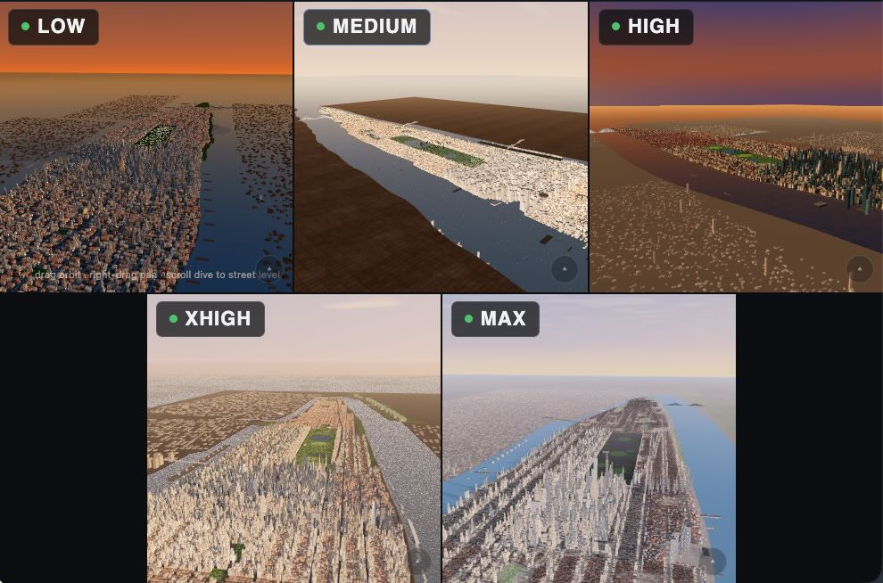
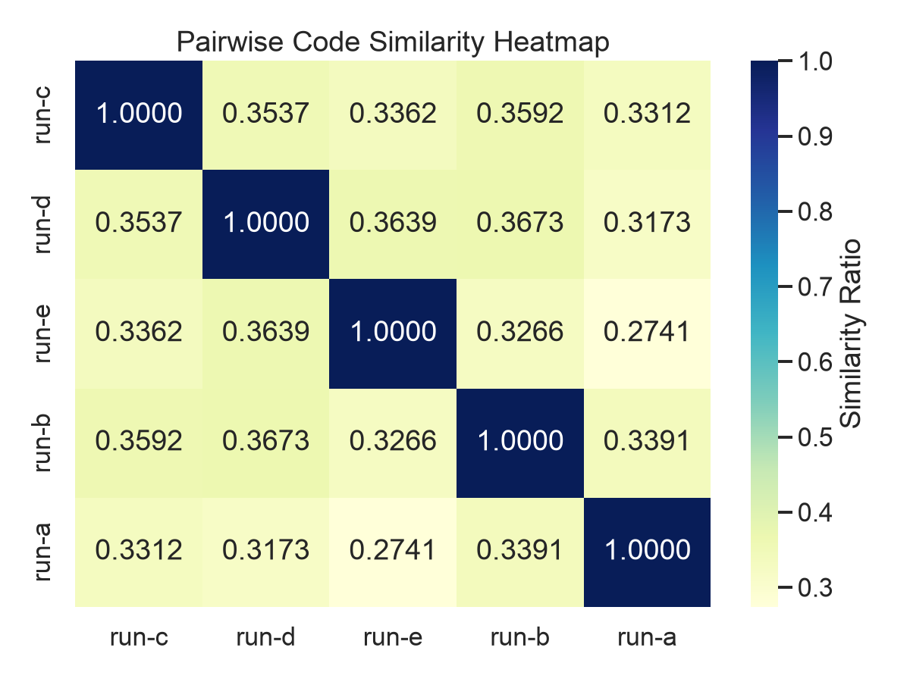

# manhattan analysis code

what happens to claude thinking various versions, [ref].
outputs seem _similar_ based on [web].

> low effort too 12 minutes, max effort took nearly 2 hours

| Effort | Tokens | Tool calls | Time | Lines of code |
| --- | --- | --- | --- | --- |
| Low | 73.2k | 27 | 12m 0s | 711 |
| Medium | 190.3k | 58 | 44m 0s | 1,702 |
| High | 296.3k | 88 | 1h 15m 42s | 1,660 |
| XHigh | 261.7k | 165 | 1h 35m 30s | 2,291 |
| Max | 367.1k | 122 | 1h 50m 40s | 2,425 |

the (only slightly) more rigorous code-analysis shows minor differences.

<b>Click to expand prompt</b>

Create a maximum-ambition Three.js environment of the ENTIRE island of Manhattan, alive, from the Battery to Inwood, rendered as one continuous explorable object at golden hour. The spectacle is total scale plus continuous zoom: the first frame shows the whole island at once like the world's most detailed aerial photograph, and the camera can then dive seamlessly from that god view down toward street level where traffic moves, ferries cross and rooftop water towers catch the sun. This must not be a single district, a skyline billboard, a low-poly slab city or a fog-hidden partial model. It is the complete island.

The goal is the visual impression of a billion individually considered pieces: tens of thousands of buildings each with a real footprint, massing and roofline; the true street grid with avenues and cross streets; Central Park as a complete green world; every major bridge; piers, highways, stadiums, cemeteries, tank farms of rooftop water towers, and rivers full of traffic. Achieve this through brutal instancing discipline, procedural building generation, merged districts and nested LOD, not through raw counts.

If you use Three.js, add an import map before the module script mapping "three" and "three/addons/" to the same pinned version, and import only via those names. Everything procedural; no external data files, images or models - approximate the real geography convincingly from knowledge.

#### FIRST FRAME - THE WHOLE ISLAND IN ONE IMPOSSIBLE IMAGE
- Open on the complete island from high above the southwest, sun low over New Jersey: the full length of Manhattan receding to the north, Downtown and Midtown clusters blazing with lit glass, Central Park a perfect green rectangle, the Hudson and East rivers wrapping it in gold-flecked water, all bridges visible.
- The island must read as dense and real: the famous skyline silhouettes recognizable at a glance (One World Trade, Empire State, Chrysler, the Midtown supertalls, the Flatiron wedge), the street grid etched in shadow, ferry wakes stitching the rivers.
- The frame is full edge to edge: Brooklyn and Queens rooftops fading into haze east, New Jersey west, the harbor and a hint of the Statue of Liberty south.
- No menus, titles or reveals. The island is simply there, complete.

#### THE ZOOM IS THE SPECTACLE
- Design the entire experience around one continuous zoom range with no loading seams and no popping that breaks belief: from whole-island orbit, through district level where individual towers separate, down to neighborhood level where streets carry visible moving traffic, water towers and rooftop details resolve, and window-scale texture appears on the nearest buildings.
- At the closest tier, the nearest few blocks must genuinely reward inspection: cornices, fire escapes, rooftop HVAC and water towers, taxi streams, walk lights implied by crowd pulses, tree pits, awnings.
- Transitions between LOD tiers must be smoothly cross-faded or geo-morphed. The viewer should feel one coherent world, not tiles swapping.

#### THE ISLAND, HONESTLY BUILT
- Respect the real macro-geography: the tapering southern tip, the grid rotating north of the Village, Broadway cutting its diagonal, Central Park's exact proportion mid-island, the Harlem street rhythm, the ridge and green of the north end, the widening and narrowing of the island.
- Landmark set with true silhouettes and placements: One World Trade and the Downtown cluster; the Brooklyn, Manhattan and Williamsburg bridges; the Flatiron; Empire State; Chrysler; Grand Central's low mass among towers; the Midtown supertall row; the UN slab on the East River; the Met in the park edge; the George Washington Bridge at the top of the island.
- Everything else is procedurally generated but honest: block-correct building heights by district, tenement rows, avenue canyons, piers and the West Side Highway, stuyvesant-style superblocks, project towers uptown, and green pockets (Washington Square, Bryant Park, Riverside strip).
- Central Park is a complete sub-world: reservoir, lakes, meadows, tree masses, paths, ballfields, all readable from altitude and pleasant at mid-zoom.

#### A CITY THAT IS VISIBLY ALIVE AT EVERY SCALE
- Rivers: ferries, barges and tour boats moving with wakes; helicopters tracking the shoreline; the harbor busy to the south.
- Streets: avenue-scale traffic flows as animated streams with taxi-yellow concentration, red brake ripples and headlight sparkle in shaded canyons; crosstown streets pulse differently from avenues.
- Air and light: sun glinting and sliding across thousands of glass faces as the camera orbits, cloud shadows crossing districts, contrails, a jet on approach in the distance, birds over the park.
- Detail-tier life: at close zoom, steam from street grates, rooftop flags, moving elevated traffic on the FDR and West Side Highway.

#### LIGHT AND MATERIAL
- Golden hour as default: long shadows etching the grid, warm masonry versus cool glass, the two rivers as sheets of moving glitter, park foliage deep and saturated.
- Materials must vary by district and era: dark glass supertalls, green-roofed pre-war stone, red-brick tenements, white terracotta classics, weathered piers.
- Windows carry believable variation: sun mirrors, interior warmth beginning to show in shadowed faces, no two towers identical.

#### EXPLORATION AND CONTROLS
- Orbit, pan and zoom active immediately with beautifully tuned inertia across the whole zoom range; one reset returns to the hero island view.
- Camera presets: full-island hero; Downtown harbor orbit; Midtown canyon dive; Central Park overview; East River bridge sweep; George Washington Bridge north view back down the island.
- Compact controls only: light (golden hour / clear noon / dusk with the city lighting up window by window), river and street traffic density, and photo mode.
- Dusk mode is a required showpiece: thousands of windows igniting progressively, bridge necklaces lighting, streams of headlights.

#### PERFORMANCE AS A FIRST-CLASS FEATURE
- This prompt lives or dies on LOD engineering: merged district meshes at far tier, instanced building archetypes with per-instance variation at mid tier, bespoke detailed blocks streaming in near the camera, imposters for the far tier of the opposite end of the island.
- Traffic, boats and window lights are instanced systems with LOD behavior of their own.
- Quality selector degrades far window variation, traffic density and reflections before ever degrading island completeness or landmark silhouettes.
- Must remain smooth on a modern laptop through the entire zoom range; clamp devicePixelRatio to 2; no memory explosions. The wow is the whole island, alive, in one unbroken piece.

[ref]: https://x.com/petergostev/status/2073505851986297241
[web]: https://fable-manhattan.surge.sh/

